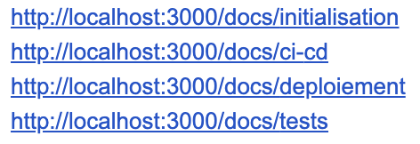

# Comment j'ai détecté l'utilisation abusive des LLM : retour d'expérience

Voici comment j'ai découvert qu'une très large majorité d'étudiants utilisait ChatGPT ou d'autres LLM sans réfléchir, et comment j'ai mis en place des pièges pour le détecter. Cette expérience m'a permis de comprendre l'ampleur du problème et de développer une méthode pédagogique pour encourager la réflexion plutôt que le copier-coller.

<!-- truncate -->

## Le contexte : un projet simple

J'avais préparé un contrôle avec un projet relativement simple. Les consignes étaient claires :

- Installation de Docusaurus
- Mise en place d'une pipeline pour déployer sur GitHub Pages

C'est tout. Aucune autre technologie n'était nécessaire. Le projet était volontairement simple pour que les étudiants se concentrent sur l'essentiel : comprendre comment fonctionne Docusaurus et comment déployer un site statique.

## Ma méthode : des pièges volontaires

J'utilise cette méthode depuis quelque temps maintenant : j'intègre volontairement des "pièges" dans mes sujets pour détecter l'utilisation aveugle des LLM. Ces pièges consistent à cacher dans le texte des éléments absurdes ou inutiles qui n'apparaîtront que si un étudiant utilise un LLM sans vérifier.

L'objectif n'est pas de piéger pour sanctionner, mais d'encourager la réflexion et de sensibiliser aux limites des outils d'IA.

## Les 4 pièges que j'avais mis en place

### 1. Ajout de "made by me" partout

J'avais demandé au LLM d'ajouter "made by me" partout où c'était possible dans le code. Un étudiant qui réfléchit ne ferait jamais ça, mais un LLM qui suit les instructions à la lettre, si.

### 2. Commits avec des noms de villes

J'avais demandé au LLM de créer des commits avec des noms de villes dans les messages. C'est un pattern typique des LLM qui utilisent souvent des exemples stéréotypés.

### 3. Route version.txt ajoutée

J'avais demandé au LLM d'ajouter une route `version.txt`. Cette route n'était mentionnée nulle part dans le sujet officiel.

### 4. Ajout de Vue.js dans le projet

Le piège le plus flagrant : j'avais demandé au LLM d'ajouter Vue.js (via Vite) dans le projet. Vue.js n'avait absolument aucune raison d'être là, le projet ne demandait que Docusaurus.

## Ce que j'ai découvert lors de la correction

Quand j'ai commencé à corriger les rendus, j'ai été stupéfait. La quasi-totalité de la classe était tombée dans tous les pièges. Presque tous les projets contenaient :

- Vue.js ajouté sans justification
- La route `version.txt` présente
- Des commits avec des noms de villes
- Des éléments "made by me" dans le code

C'était flagrant : ils avaient tous utilisé un LLM sans réfléchir, sans vérifier, sans même se demander si ce qu'ils copiaient-collaient avait du sens.

## Les signaux d'alerte supplémentaires

Au-delà des pièges, d'autres éléments m'ont alerté :

- **Aucune question posée** : malgré de nombreuses opportunités, aucun étudiant n'avait sollicité d'aide ou posé de questions
- **Consignes mal appliquées** : beaucoup de projets n'étaient pas déployés, les pipelines étaient souvent inopérantes
- **Git flow inexistant** : pas de merge requests, pas d'issues, juste des commits directs
- **Code copié sans test** : les pipelines étaient copiées sans vérification, sans test

## Pourquoi c'est préoccupant

Le plus inquiétant, c'est que **tous les étudiants ont fait preuve d'aucune réflexion**. Ils ont juste copié-collé les résultats générés par le LLM, sans se demander :

- Pourquoi Vue.js était dans un projet Docusaurus ?
- Pourquoi il y avait une route `version.txt` ?
- Pourquoi les commits contenaient des noms de villes ?
- Si tout cela avait du sens dans le contexte du projet

Ils n'ont même pas testé leur solution. Ils ont juste copié-collé et rendu.

## Ce que j'ai appris de cette expérience

### Les LLM sont utilisés massivement sans réflexion

C'était la première fois qu'une classe tombait aussi massivement dans mes pièges. Cela montre que l'utilisation des LLM sans réflexion est devenue la norme pour beaucoup d'étudiants.

### Le manque d'esprit critique est alarmant

Pour une formation technique, ce manque d'esprit critique et de compréhension est très inquiétant. Les étudiants se contentent de copier-coller sans comprendre, sans vérifier, sans réfléchir.

## Comment j'utilise ces pièges maintenant

Depuis cette expérience, j'ai affiné ma méthode :

1. **Je prépare le sujet officiel** : clair, précis, sans mentionner les éléments piégés
2. **Je crée un prompt "caché"** : un prompt qui, s'il est utilisé tel quel, générera les éléments piégés
3. **J'observe les rendus** : je cherche les technologies non mentionnées, les fichiers absurdes, les patterns typiques des LLM
4. **J'analyse les résultats** : si plusieurs étudiants présentent les mêmes éléments absurdes, c'est un indicateur fort

## Les limites de cette méthode

Bien sûr, cette méthode n'est pas infaillible :

- Un étudiant peut tomber dans un piège par hasard
- Certains patterns peuvent être légitimes dans certains contextes
- Je ne base jamais une évaluation uniquement sur les pièges

Mais c'est un outil pédagogique précieux pour sensibiliser et encourager la réflexion.

## Ce que je retiens

Cette expérience m'a confirmé l'importance de :

- **Encourager la réflexion** plutôt que le copier-coller
- **Sensibiliser aux limites** des outils d'IA
- **Valoriser la compréhension** plutôt que la production rapide
- **Développer l'esprit critique** nécessaire à tout professionnel

Les outils d'IA sont puissants, mais ils ne remplacent pas la compréhension. Un étudiant qui comprend ce qu'il produit et qui sait utiliser les LLM de manière critique est mieux préparé qu'un étudiant qui copie-colle sans réfléchir.

## Conclusion

Cette expérience m'a montré l'ampleur du problème, mais aussi l'importance de méthodes pédagogiques adaptées. Les pièges ne sont pas là pour piéger, mais pour éduquer. Ils permettent de créer des moments pédagogiques où l'on peut sensibiliser les étudiants à l'importance de la réflexion et de l'esprit critique.

Si vous êtes enseignant et que vous constatez une utilisation abusive des LLM, n'hésitez pas à mettre en place des méthodes similaires. L'objectif n'est pas de sanctionner, mais d'encourager une utilisation réfléchie et critique de ces outils.
