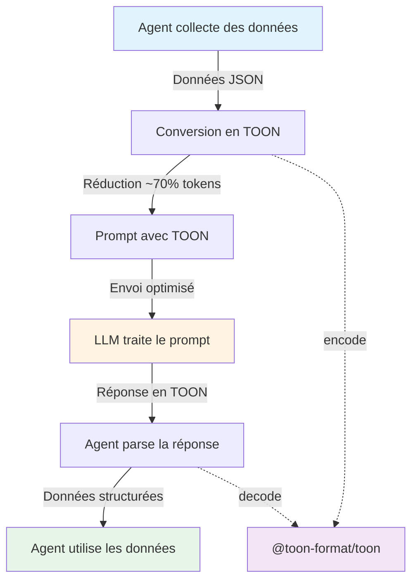

import { useState } from 'react';
import { encode } from '@toon-format/toon';
import { Backlink } from '@koroligor/docusaurus-plugin-backlinks/components';

# TOON - Token-Oriented Object Notation

[TOON](https://github.com/toon-format/toon) (Token-Oriented Object Notation) est un format de sérialisation compact, lisible par l'homme et conscient du schéma, conçu spécifiquement pour les prompts LLM. Il permet de réduire significativement le nombre de tokens utilisés tout en restant lisible.

## Qu'est-ce que TOON ?

TOON est une alternative compacte à JSON qui :

- **Réduit les tokens** : Jusqu'à 70% de tokens en moins par rapport à JSON
- **Reste lisible** : Format lisible par l'homme
- **Conscient du schéma** : Le schéma est intégré dans le format
- **Optimisé pour les LLM** : Conçu spécifiquement pour les prompts d'IA

## Format de base

TOON utilise une syntaxe compacte où le schéma est défini dans l'en-tête :

```toon
users[2]{id,name,role}:
  1,Alice,admin
  2,Bob,user
```

Au lieu de JSON :

```json
{
  "users": [
    { "id": 1, "name": "Alice", "role": "admin" },
    { "id": 2, "name": "Bob", "role": "user" }
  ]
}
```

## Exemple interactif

Essayez de convertir du JSON en TOON :

export const ToonConverter = () => {
  const [jsonInput, setJsonInput] = useState(`{
  "users": [
    { "id": 1, "name": "Alice", "role": "admin" },
    { "id": 2, "name": "Bob", "role": "user" }
  ]
}`);
  const [toonOutput, setToonOutput] = useState('');
  const [error, setError] = useState('');

  const convertToToon = () => {
    try {
      setError('');
      const data = JSON.parse(jsonInput);
      
      // Utiliser la bibliothèque officielle pour convertir n'importe quel objet
      const toon = encode(data);
      setToonOutput(toon);
    } catch (e) {
      const errorMessage = e instanceof Error ? e.message : 'Erreur inconnue';
      setError(`Erreur : ${errorMessage}`);
      setToonOutput('');
    }
  };

  return (
    <div style={{
      padding: '2rem',
      margin: '2rem 0',
      border: '2px solid var(--ifm-color-primary)',
      borderRadius: '10px',
      backgroundColor: 'var(--ifm-background-surface-color)',
    }}>
      <h3>Convertisseur JSON vers TOON</h3>
      {error && (
        <div style={{
          padding: '0.75rem',
          marginBottom: '1rem',
          backgroundColor: 'var(--ifm-color-danger)',
          color: 'white',
          borderRadius: '5px',
          fontSize: '0.9rem',
        }}>
          {error}
        </div>
      )}
      <div style={{ display: 'grid', gridTemplateColumns: '1fr 1fr', gap: '1rem', marginTop: '1rem' }}>
        <div>
          <label style={{ display: 'block', marginBottom: '0.5rem', fontWeight: 'bold' }}>
            JSON :
          </label>
          <textarea
            value={jsonInput}
            onChange={(e) => setJsonInput(e.target.value)}
            style={{
              width: '100%',
              minHeight: '200px',
              padding: '0.5rem',
              fontFamily: 'monospace',
              fontSize: '0.9rem',
              border: '1px solid var(--ifm-color-emphasis-300)',
              borderRadius: '5px',
              backgroundColor: 'var(--ifm-background-color)',
              color: 'var(--ifm-color-content)',
            }}
          />
        </div>
        <div>
          <label style={{ display: 'block', marginBottom: '0.5rem', fontWeight: 'bold' }}>
            TOON :
          </label>
          <textarea
            value={toonOutput}
            readOnly
            style={{
              width: '100%',
              minHeight: '200px',
              padding: '0.5rem',
              fontFamily: 'monospace',
              fontSize: '0.9rem',
              border: '1px solid var(--ifm-color-emphasis-300)',
              borderRadius: '5px',
              backgroundColor: 'var(--ifm-background-surface-color)',
              color: 'var(--ifm-color-content)',
            }}
          />
        </div>
      </div>
      <button
        onClick={convertToToon}
        style={{
          marginTop: '1rem',
          padding: '0.75rem 1.5rem',
          fontSize: '1rem',
          backgroundColor: 'var(--ifm-color-primary)',
          color: 'white',
          border: 'none',
          borderRadius: '5px',
          cursor: 'pointer',
          transition: 'all 0.3s ease',
        }}
        onMouseOver={(e) => {
          e.target.style.transform = 'scale(1.05)';
          e.target.style.boxShadow = '0 4px 8px rgba(0,0,0,0.2)';
        }}
        onMouseOut={(e) => {
          e.target.style.transform = 'scale(1)';
          e.target.style.boxShadow = 'none';
        }}
      >
        Convertir en TOON
      </button>
    </div>
  );
};

<ToonConverter />

## Avantages de TOON

### Réduction des tokens

TOON peut réduire jusqu'à 70% le nombre de tokens par rapport à JSON, ce qui est crucial pour les prompts LLM où chaque token compte.

### Lisibilité

Même s'il est compact, TOON reste lisible par l'homme, ce qui facilite le débogage et la maintenance.

### Optimisé pour les LLM

TOON est conçu spécifiquement pour être utilisé avec les LLM. Le format est auto-documenté et les modèles comprennent naturellement la structure.

## Utilisation avec les LLM

Pour utiliser TOON avec les LLM, il est recommandé de :

1. **Montrer le format** plutôt que de le décrire
2. **Utiliser des blocs de code** avec la syntaxe ` ```toon `
3. **Montrer le template d'en-tête** quand on demande aux modèles de générer du TOON

### Exemple de prompt


Voici un exemple de données au format TOON :

```toon
users[2]{id,name,role}:
  1,Alice,admin
  2,Bob,user
```

Génère maintenant une liste de 3 produits au format TOON avec les champs : id, name, price, category

## Utilisation avec des agents

TOON est particulièrement adapté pour les systèmes d'agents qui communiquent avec des LLM. Le diagramme suivant illustre le flux d'utilisation :



### Avantages pour les agents

1. **Réduction des coûts** : Moins de tokens = coûts d'API réduits
2. **Latence améliorée** : Moins de données à transmettre = réponses plus rapides
3. **Meilleure compréhension** : Le format auto-documenté aide le LLM à mieux comprendre la structure
4. **Parsing simplifié** : Les bibliothèques TOON facilitent la conversion bidirectionnelle

### Exemple de workflow agent

```typescript
import { encode, decode } from '@toon-format/toon';

// Agent collecte des données
const userData = {
  users: [
    { id: 1, name: 'Alice', role: 'admin' },
    { id: 2, name: 'Bob', role: 'user' }
  ]
};

// Conversion en TOON pour le prompt
const toonData = encode(userData);
const prompt = `Voici les utilisateurs au format TOON:\n\`\`\`toon\n${toonData}\n\`\`\`\nAnalyse-les et génère un rapport.`;

// LLM répond en TOON
const llmResponse = `products[2]{id,name,price}:
  1,Laptop,999
  2,Mouse,29`;

// Agent parse la réponse
const products = decode(llmResponse);
console.log(products); // { products: [{ id: 1, name: 'Laptop', price: 999 }, ...] }
```

## Installation et utilisation

### CLI (sans installation)

```bash
# Convertir JSON en TOON
npx @toon-format/cli input.json -o output.toon

# Depuis stdin
echo '{"name": "Ada", "role": "dev"}' | npx @toon-format/cli
```

### Bibliothèque TypeScript

```bash
npm install @toon-format/toon
```

```typescript
import { encode } from '@toon-format/toon'

const data = {
  users: [
    { id: 1, name: 'Alice', role: 'admin' },
    { id: 2, name: 'Bob', role: 'user' }
  ]
}

console.log(encode(data))
// users[2]{id,name,role}:
//   1,Alice,admin
//   2,Bob,user
```

## Cas d'usage

TOON est particulièrement utile pour :

- **Prompts LLM** : Réduire les coûts de tokens
- **Données structurées** : Transmettre des données complexes de manière compacte
- **APIs** : Réponses plus légères
- **Stockage** : Format compact pour les données

## Ressources

- [GitHub Repository](https://github.com/toon-format/toon)
- [Documentation officielle](https://toonformat.dev)

## Conclusion

TOON est un format innovant qui combine compacité et lisibilité, parfait pour les interactions avec les LLM. Il permet de réduire significativement les coûts de tokens tout en gardant un format lisible et maintenable.

<Backlink documentPath="/docs/llms-ai/toon" />
